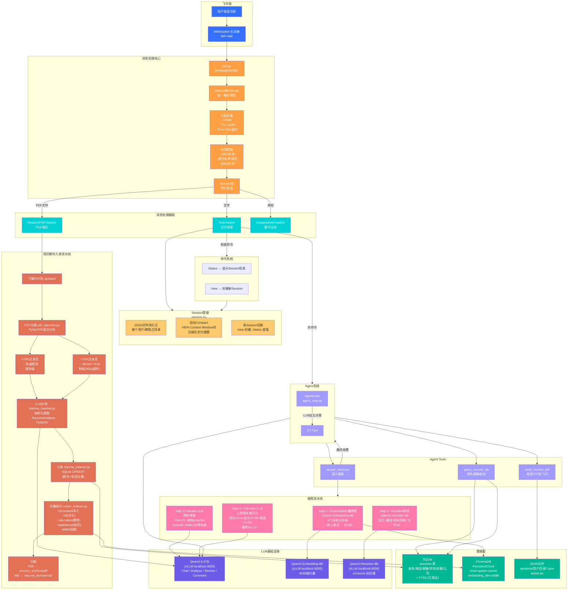

# resume-bot 架构流程图



## 核心数据流

### 1️⃣ 对话流程（文字消息）
```
用户输入 → WebSocket → bot.py(去重/权限/锁) 
  → TextHandler → AgentLoop(LLM自主决策)
    ├─ 直接回答 → 回复用户
    ├─ search_resumes → 向量搜 → Reranker → Review → Comment → 回复
    ├─ query_resume_db → SQLite → 回复
    └─ send_resume_pdf → 归档取PDF → 飞书API发送
  → Session.messages.append() → JSON持久化
```

### 2️⃣ 简历入库流程（PDF上传）
```
PDF文件 → ResumePDFHandler
  → 下载 → PyMuPDF分类
    ├─ 快路(>70%文本): PyMuPDF直接提取(毫秒)
    └─ 慢路(<70%): MinerU VLM HTTP客户端(秒级)
  → LLM分析(StructuredOutput) → ResumeAnalysis
  → SQLite UPSERT(姓名+电话去重)
  → ChromaDB 4段向量(full/edu/exp/skills)
  → 归档PDF+MD
```

### 3️⃣ 搜索流水线
```
用户查询 → search_resumes tool
  ├─ 向量搜索: ChromaDB cosine → 每人4分 → 聚合 → 前300
  ├─ Reranker: 全文+最佳段落双路 → 前50
  ├─ Review LLM: 两轮(初判+Reflect) → pass/fail
  └─ Comment LLM: 并发5维打分 → 排序 → top 10
```
